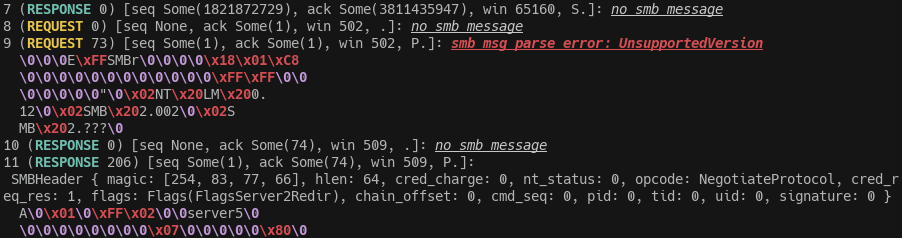
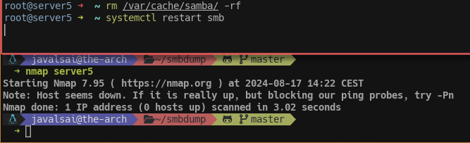

# smb-tcpdump-analysis
This is just a rust tool that tries to analyze `tcpdump` output as SMB traffic and print the "conversation" in simple terms (no support for SMB1 messages).

This doesn't have to be exclusive to SMB, it has a module dedicated to parsing tcpdump output, so if you just wanna use that for another protocol is fine, the license allows anything.

Perfect (IMO) for when just windows doesn't load the SMB share and the most useful thing you have is a generic error code and "Unspecified Error".

> [!WARNING]
> This is mostly WIP, but I fixed the issue by just deleting samba cache (`/var/cache/samba/`, which bricked my server temporarily fsr). I think it was corrupted and I found out when `doas pdbedit -Lv` said something about Mutex size change warning coming from a path under that cache.... (Samba moment)
>
> Long story short, I won't keep working on this, good luck with your samba issues tho 👍

we ♥️ samba

# Contributing
Sure, I'll likely keep an eye on this, and if you manage to add support to this or just fix something, consider opening a PR to help others using this tool. This has a bunch of messy code, but I think it's not that bad.

If the project is dead and you want go ahead and maintain your own version, I just made this to help someone in need, I really don't care about author rights on it.

# Cargo Features
Yeah, there's a cargo feature called "color" but I have a bunch of colors hardcoded without checking for it (I think just in `main.rs` tho), so disabling it still leaves colors around.
